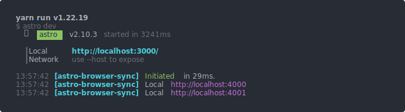

<div align="center">

</div>
<div align="center">

# astro-browser-sync

</div>

Add BrowserSync in your Astro Project.

<div align="center">



</div>

## Usage

Manual Install,

```bash
npm i astro-browser-sync -D
```

If you want to manage BrowserSync or override default behavior of this integration, you can pass a `browserSyncOptions` object with your [BrowserSync options](https://browsersync.io/docs/options) in it :

```ts
// astro.config.mjs
import { defineConfig } from "astro/config";
import broswerSync from 'astro-browser-sync'

export default defineConfig({
    //....
   integrations: [
      // Default Config
      browserSync({
        mode: 'verbose',
        browserSyncOptions: {
          port: 4000,
          open: true,
          ui: {
            port: 4001,
          },
          notify: true,
        }
      }),
   ]
})
```

## Changelog

See [CHANGELOG.md](CHANGELOG.md) for a history of changes to this integration.
